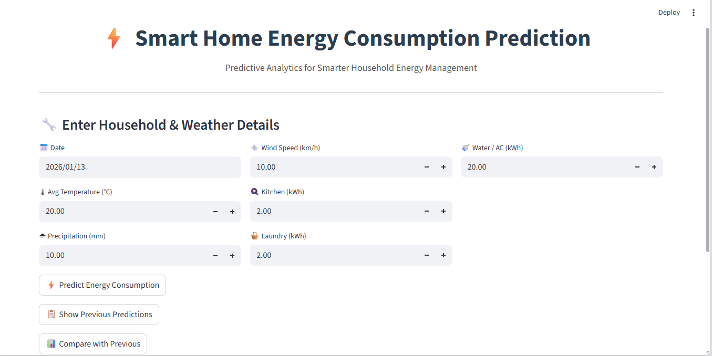
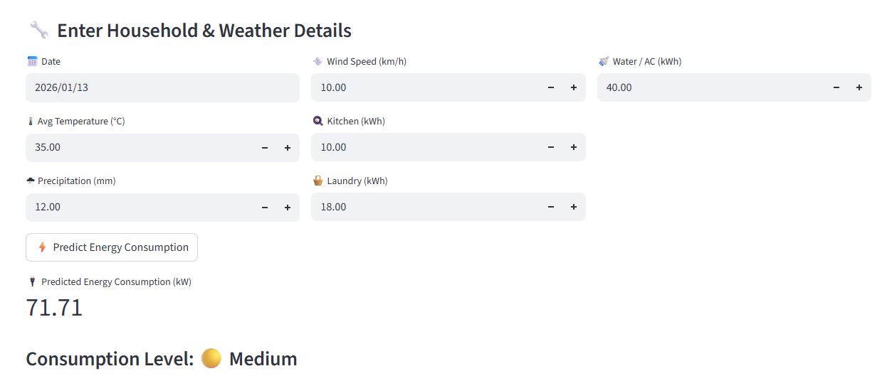
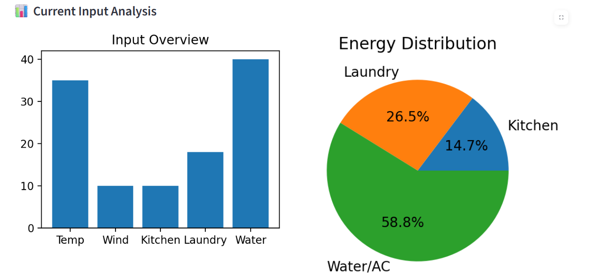
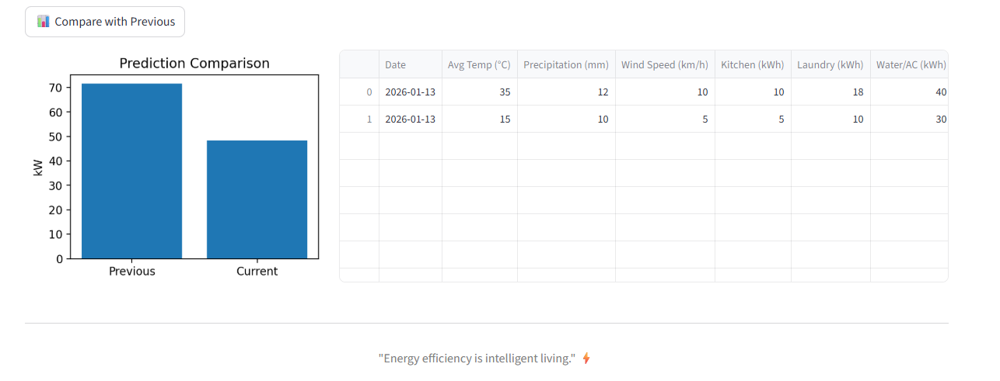

# ⚡ Smart Home Energy Consumption Prediction

An end-to-end Machine Learning project that predicts **household energy consumption** using historical smart meter data and weather conditions.  
The project includes data preprocessing, feature engineering, model training, evaluation, and an **interactive Streamlit web application**.

---

## 🚀 Project Overview

Smart homes generate large amounts of energy usage data through smart meters.  
This project leverages Machine Learning to analyze historical power consumption patterns and external weather factors to **predict household energy usage accurately**.

The final outcome is a **user-friendly web application** that allows users to input weather and household usage details and receive energy consumption predictions along with visual insights.

---

## ✨ Key Features

- Predicts **Global Active Power (kW)**
- Combines **smart meter data + weather data**
- Advanced **feature engineering**:
  - Lag features
  - Seasonal indicators
  - Weather interaction features
- High-performing ML model with excellent accuracy
- Interactive **Streamlit web application**
- Visual insights using:
  - Bar charts
  - Pie charts
  - Line charts

---

## 🧠 Machine Learning Model

- **Algorithm**: Linear Regression  
- **Target Variable**: Global Active Power  
- **Evaluation Metrics**:
  - R² ≈ **0.99**
  - Low RMSE and MAE  
- **Why Linear Regression?**
  - Strong linear relationships in the dataset
  - High interpretability
  - Excellent performance on unseen data

---

## 📊 Dataset Information

### Household Power Consumption Dataset
- Source: **UCI Machine Learning Repository**
- Minute-level household energy usage data
- Includes voltage, current intensity, and sub-metering values

### Weather Dataset
- Source: **Meteostat API**
- Location: Sceaux, France
- Includes temperature, precipitation, wind speed, and pressure

---

## 📁 Project Structure
```
smart-home-energy-prediction/
│
├── app.py
├── energy_model.pkl
├── final.ipynb
├── requirements.txt
│
├── datasets/
│ ├── household_power_consumption.csv
│ └── sceaux_weather_data.csv
│
├── screenshots/
│ ├── Inputs.png
│ ├── Prediction.png
│ ├── Current_input_visual.png
│ ├── Recorded_predictions.png
│ └── Prediction_comparison.png
│
└── README.md
```
---

## 🖥️ Streamlit Application Screenshots

### 🏠 Home Page


### ✍️ Prediction Output


### 🔮 Input Visual Insights


### 📊 Recorded predictions


### 📊 Prediction Comparison


---

## ▶️ How to Run the Application

```bash
pip install -r requirements.txt
```
```bash
streamlit run app.py
```


